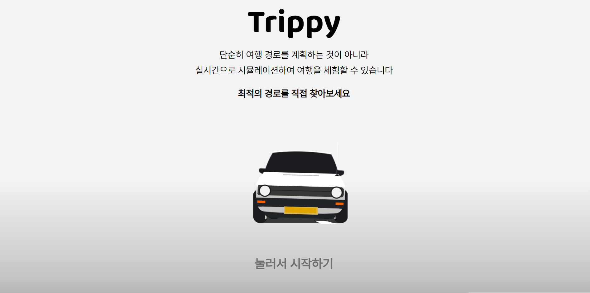
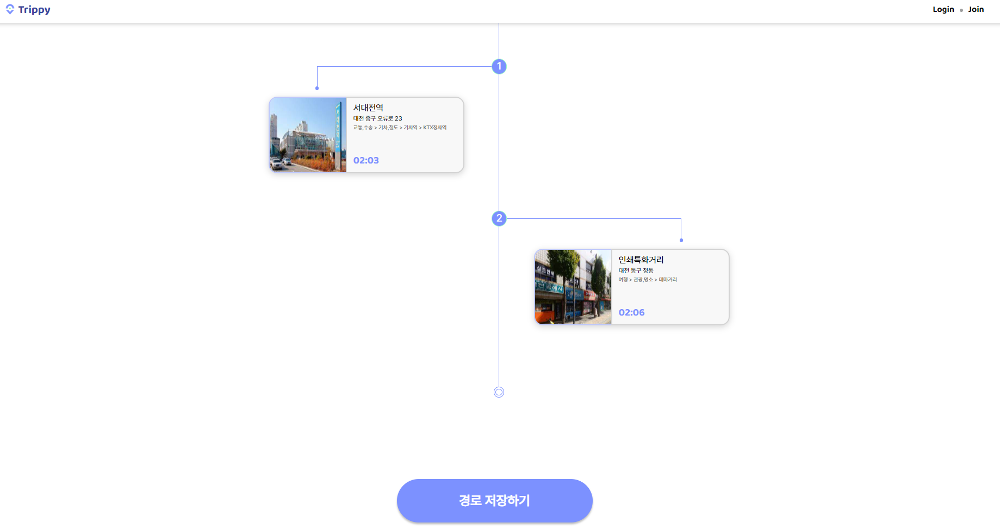

# Trippy

### 서비스 기획

여행을 계획하는 것이 어려운 사람들을 위해 즉흥적으로 떠나는 상황을 시뮬레이션하며 근처의 관광지나 식당을 골라 자신만의 여행 경로를 만드는 웹 사이트

### 웹 사이트 화면

#### 메인화면

#### SMTP를 활용한 이메일 인증

#### 여행 경로 편집

#### 경로 시뮬레이션 화면

#### 시물레이션 결과 요약 화면

